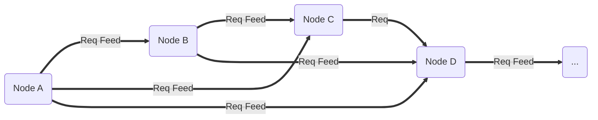

### Distributed TCP node hive

#### Connection Graph

```mermaid
graph LR
NA(Node A) == Req Feed===> NB(Node B) ==Req Feed===> NC(Node C) == Req ===> ND(Node D)
NA == Req Feed===> NC
NA == Req Feed===> ND
NB == Req Feed===> ND
ND == Req Feed===> NE(...)
```